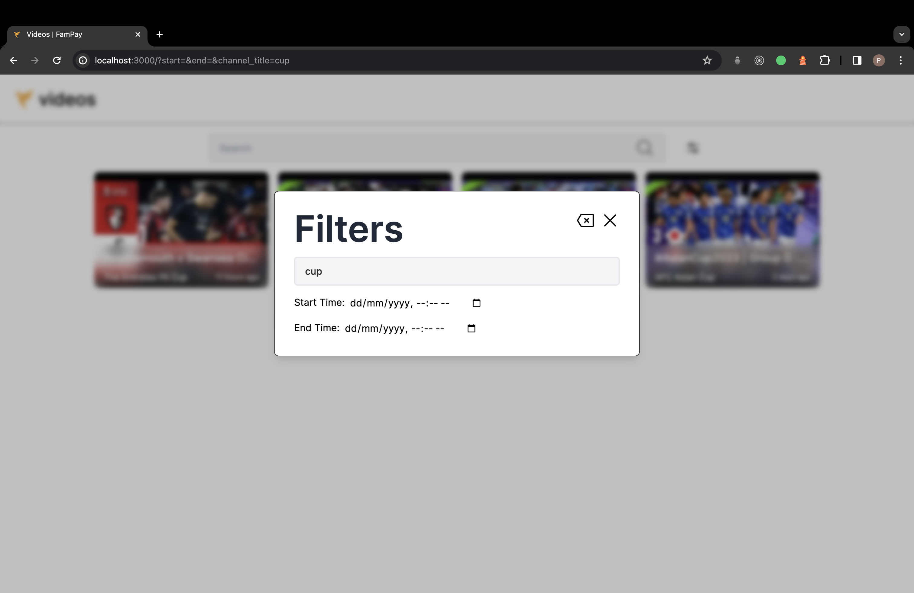
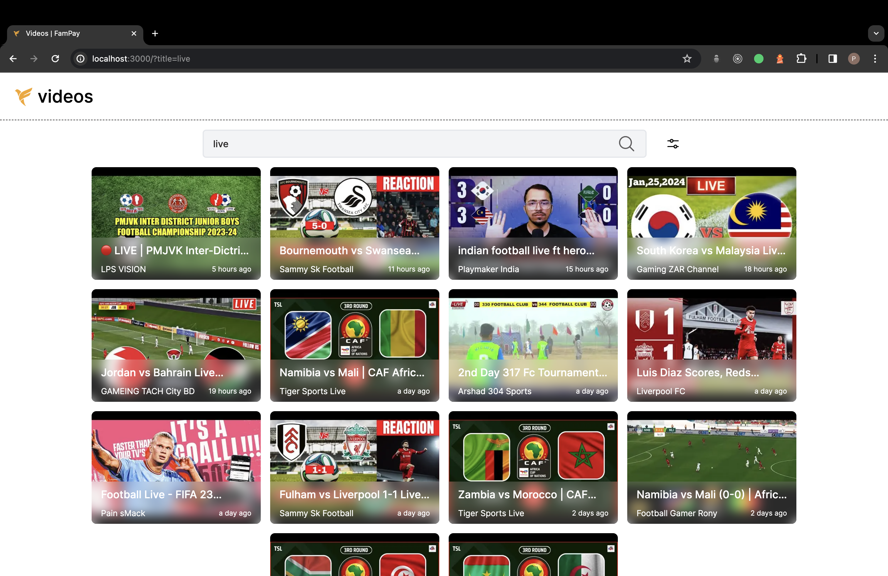
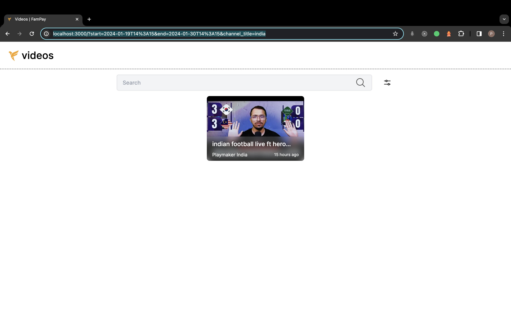

# FamPay Backend Internship Task

## Overview

Welcome to the FamPay **Videos** repository! This repository combines the frontend and backend components required for the task assigned during the Backend internship process at FamPay.

## Repository Structure

- **FamPay-frontend:** This folder contains the frontend code for the web interface. It is implemented in TypeScript using Next.js and styled with Tailwind CSS.

- **FamPay-backend:** The backend logic resides in this folder. It is developed in Golang, utilizing the goFiber web framework and GORM as the Object-Relational Mapping (ORM) library. The backend integrates with PostgreSQL for the main database and utilizes Redis for caching.

## Task Description

The task assigned for the Backend internship process at FamPay involves creating a server application with the following basic requirements:

- Continuously call the YouTube API in the background with a specified interval (e.g., 10 seconds).
-  Fetch the latest videos for a predefined search query.
- Store relevant video data in a database with proper indexes.
- Create a GET API to retrieve stored video data in a paginated response, sorted in descending order of the published datetime.
- Ensure scalability and optimization of the system.
  
Bonus points can be earned by implementing the following additional features:

- Support for supplying multiple API keys to automatically switch to the next available key if the quota is exhausted.
- Optional creation of a dashboard with filters and sorting options for viewing the stored videos.

*All the features mentioned here have been implemented.*

## Technologies Used

#### Frontend

- **Language:** TypeScript
- **Framework:** Next.js
- **CSS Framework:** Tailwind CSS

#### Backend

- **Language:** Golang
- **Web Framework:** goFiber
- **ORM:** GORM
- **Databases:** PostgreSQL (main database), Redis (caching)

## Usage

To utilize the FamPay Videos Interface, follow these steps:

#### - Clone the Repository

```bash
git clone https://github.com/Pratham-Mishra04/fampay-task
cd fampay-task
```

#### - Run the docker commands in both the folders
Navigate to the respective directories and execute the following Docker command: 

```bash
sudo docker compose up --build -d
```

**( refer the respective running frontend and backend sections )**

# Web Interface (Frontend)

## Directory Structure

The frontend of the FamPay Videos is organized with the following directory structure:

- **/public:** Public assets and files.

- **/src/components:** React components used throughout the application.

- **/src/handlers:** Request handlers responsible for connecting with the backend.

- **/src/pages:** Individual pages of the web application.

- **/src/styles:** Styling files, including CSS or other styling languages.

- **/src/utils:** Utility functions and helper files.

## Environment Variables

Copy the `env.sample` file to `.env` and customize it according to your needs. This file contains environment variables used by the frontend.

## Running the Frontend

To run the FamPay Videos Frontend, follow these steps:

1. Ensure you have Docker installed on your system.

2. Open a terminal and navigate to the root directory of the frontend.

3. Copy env from  *env.sample* and make changes only if necessary.
    ```bash
    sudo nano .env
   ```

4. Run the following command:

    ```bash
    sudo docker compose up --build
    ```

5. The application will be accessible at `http://localhost:3000` by default.

## Screenshots

*Home Page*


*Filter Box*



*Filter Example*



*Multiple Filter Example*




# API (Backend)

## Log Model

The `Video` model is structured as follows:

- **ID:** ID assigned by the backend.
- **Youtube ID:** ID assigned by youtube services.
- **Title:** Title of the Video.
- **Channel ID:** ID of the channel which uploaded the Video.
- **Channel Title:** Title of the channel which uploaded the Video.
- **Description:** Description of the Video.
- **Thumbnail:** High Resolution Thumbnail of the Video.
- **Uploaded At:** Timestamp of when the Video was uploaded.

##  Get Videos Endpoint

- **Endpoint:** `GET /`
- **Description:** Retrieve all videos, with optional query parameters for pagination and filtering.
- **Query Parameters:**
  - `page`: Page number for paginated queries (default: 1).
  - `limit`: Number of videos per page in paginated queries (default: 10).
  - `title`: Search videos by video title.
  - `channel_title`: Search videos by channel title.
  - `start`: Filter videos starting from a specific time.
  - `end`: Filter videos up to a specific time.
- **Sample Request**
    `/?page=1&limit=10&title=live`
  <small>*- Multiple queries are supported*</small>
- **Response Format:**
  ```json
  {
    "status": "success"|"failed",
    "message": "Message from the API",
    "videos": [
      {
      "id": 1,
      "youtubeID": "id",
      "title": "Live:India vs England 1st Test",
      "channelID": "UC-ezJZD3_zet4Sblaemnxnw",
      "channelTitle": "Golden Cricket",
      "description": "Live:India vs England 1st Test Day 2 Live.",
      "thumbnail": "https://i.ytimg.com/vi/BWkTVE4ejRQ/default.jpg",
      "uploadedAt": "2024-01-26T12:05:10+05:30"
      },
      // Additional video entries...
    ]
  }
  ```

## Caching

Redis is utilized for caching in this system. The filters used in queries are converted into a hash, serving as the key for the Redis storage. This approach ensures that redundant queries for the same filter do not incur additional processing time. The Redis storage also considers pagination, using the default limit of 10.

## Environment Variables

A sample of the environment file is provided in the root directory of the backend, named `.env.sample`.

## API Keys

A sample of the keys file is provided in the root directory of the backend, named `keys.txt.sample`.

Provide all the available keys in a txt file and ensure that the location (name, if in root folder) of this file matches with the environment variable `YOUTUBE_API_KEYS_LOCATION`.

#### Rotation of API Keys

When multiple files are available in `keys.txt` file, and one key is exhausted, the server will switch to the next key automatically, displaying a message `Switched to API key 2`, and so on. 

When all the keys are exhausted, an error is thrown `All KEYS have been exhausted!` *(this can be disabled at fampay-backend/helpers/service.go)*

`! DON'T FORGET TO GET KEYS AND ENABLE YOUR YOUTUBE API`

## Running the Backend

To run the FamPay Videos Backend, follow these steps:

1. Ensure you have Docker installed on your system.

2. Open a terminal and navigate to the root directory of the backend.

3. Copy env from  *env.sample* and make changes only if necessary.
    ```bash
    sudo nano .env
   ```

4. Run the following command:

    ```bash
    sudo docker compose up --build
    ```

5. The application will be accessible at `http://localhost:8000` by default.

6. All the logs from the application can be viewed in `fampay-backend/logs` directory.
   
7. Default topic of search has been set to ***football***, it can be changed at `fampay-backend/config/service.go - ServiceQuery`
   
8. Data is been fetched from the Youtube API every ***10 seconds*** by default, it can be changed at `fampay-backend/config/service.go - RepeaterDelay`


## Efficiency

The architecture prioritizes speed and efficiency. Golang is chosen for its excellent support for multi-core processing. Entire architecture uses goroutines to establish multiple concurrent connections to the database, leveraging multiple CPU cores to process requests rapidly. In case of any errors, they are logged in the logs folder.

PostgreSQL is chosen due to its ACID compliance, ensuring efficient and secure handling of multiple connections without concerns about transaction overhead or data integrity.

Redis is utilized for caching in this system. The filters used in queries are converted into a hash, serving as the key for the Redis storage. This approach ensures that redundant queries for the same filter do not incur additional processing time.

## Database Sharding (Exploration)

While developing the FamPay Videos, I considered the option of implementing database sharding to enhance scalability. Although familiar with the concept, I hadn't previously implemented it in PostgreSQL.

In my exploration, I came across a PostgreSQL extension called **Citus**, specifically designed for enabling distributed database architectures through sharding. I delved into the documentation and began the integration process.

However, considering the limited time available and the diverse set of features to implement, I made the decision not to include Citus in the final model for this project. My primary concern was the potential introduction of unforeseen errors that might require extensive debugging.

Now equipped with the knowledge of Citus, I plan to further explore and experiment with it in future projects. The scalability benefits offered by database sharding are intriguing, and I look forward to incorporating such advanced techniques into upcoming endeavors.

This decision allowed me to prioritize completing the core functionality within the given timeframe while acknowledging the potential for future enhancements through advanced database sharding techniques.

# Conclusion

In the span of just 10-12 hours, building the FamPay Videos Interface has been an exhilarating experience. The focus on speed and efficiency, coupled with technologies like Golang, PostgreSQL, and Redis, has allowed me to craft a robust and performant system.

Navigating through the intricacies of Golang's multi-core processing, leveraging Docker for seamless deployment, and implementing caching with Redis has been both challenging and rewarding. The choice of PostgreSQL for its ACID compliance has ensured a reliable foundation for handling multiple connections without compromising on transactional integrity.

As the codebase comes together, I'm eager to show it to the concerned authorities and know how can I improve on this. I really look forward to hearing back from FamPay and eagerly anticipate the opportunity to discuss and showcase my skills in the next stages of the selection process.

Thank you for the opportunity, and I'm enthusiastic about the possibility of contributing to the innovative work at FamPay!

Best Regards,
Pratham Mishra
